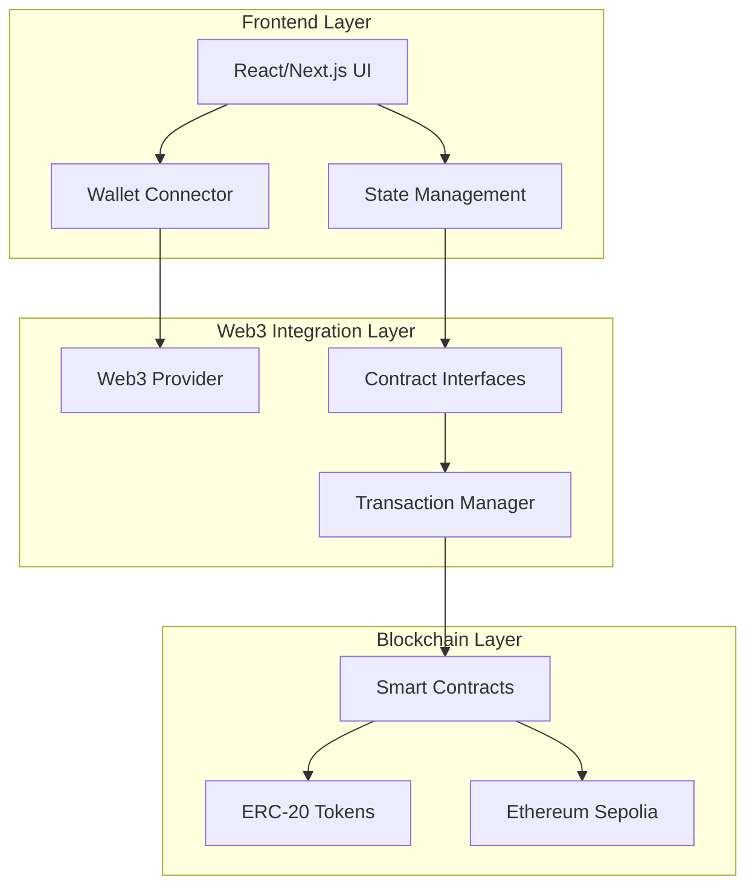

# AMM DEX 設計書

## 概要

本設計書は、Ethereum Sepolia上で動作するUniswapライクなAMM DEXの技術設計を定義します。このDEXは、x*y=k定数積公式を使用した自動マーケットメーカーとして機能し、ERC-20トークン間の分散型取引を可能にします。

## アーキテクチャ

### システム全体構成



### モノレポ構造

```
pkgs/
├── contract/          # スマートコントラクト開発
│   ├── README.md
│   ├── contracts/     # Solidityコントラクト
│   ├── hardhat.config.ts # Hardhat設定ファイル
│   ├── helpers/       # ユーティリティ関数
│   ├── ignition/      # デプロイメントスクリプト
│   ├── outputs/       # デプロイメント出力
│   ├── package.json
│   ├── tasks/         # Hardhatタスクファイル群
│   ├── test/          # テストコード群（.test.ts）
│   ├── .solhint.json  # solhint設定ファイル
│   ├── .solhintignore
│   └── tsconfig.json
└── frontend/         # フロントエンドアプリケーション
    ├── app/          # Next.js Page Routerディレクトリ
    │   └── api/      # APIの実装
    ├── components/   # UIコンポーネント
    ├── hooks/        # カスタムフック
    ├── lib/          # ライブラリ用関数群
    ├── utils/        # ユーティリティ関数群
    ├── styles/       # グローバルスタイル・テーマ
    ├── public/       # 静的ファイル群
    ├── components.json # shadcn/UI設定ファイル
    ├── package.json  # パッケージ設定
    ├── tsconfig.json # TypeScript設定
    ├── tailwind.config.js # Tailwind CSS設定
    ├── postcss.config.js # PostCSS設定
    ├── next.config.js # Next.js設定
    ├── next-env.d.ts # Next.js型定義
    ├── .env.local    # 環境変数設定
    ├── .env.example  # 環境変数サンプル
    └── .gitignore    # Git無視設定
```

## 技術スタック

### スマートコントラクト開発
- **Solidity**: スマートコントラクト実装言語
- **TypeScript**: 型安全なJavaScript開発
- **pnpm**: 高速パッケージマネージャー
- **Hardhat**: 開発・テスト・デプロイフレームワーク
- **hardhat-gas-reporter**: ガス使用量レポート
- **solhint**: Solidityコードリンター
- **viem**: 軽量Web3ライブラリ
- **OpenZeppelin**: セキュアなコントラクトライブラリ
- **Alchemy RPC**: Ethereum接続プロバイダー

### フロントエンド開発
- **TypeScript**: 型安全なJavaScript開発
- **pnpm**: 高速パッケージマネージャー
- **Next.js**: React フレームワーク（Page Router）
- **PWA**: プログレッシブWebアプリケーション
- **TailwindCSS**: ユーティリティファーストCSS
- **Shadcn/UI**: モダンUIコンポーネントライブラリ
- **viem**: 軽量Web3ライブラリ
- **wagmi**: React Web3フック
- **RainbowKit**: ウォレット接続UI

## コンポーネントとインターフェース

### スマートコントラクト設計

#### 1. Factory Contract (DEXFactory.sol)

```solidity
interface IDEXFactory {
    function createPair(address tokenA, address tokenB) external returns (address pair);
    function getPair(address tokenA, address tokenB) external view returns (address pair);
    function allPairs(uint) external view returns (address pair);
    function allPairsLength() external view returns (uint);
    function feeTo() external view returns (address);
    function feeToSetter() external view returns (address);
}
```

**責務:**
- 新しい流動性ペアの作成
- ペアアドレスの管理
- 手数料受取先の管理

#### 2. Pair Contract (DEXPair.sol)

```solidity
interface IDEXPair {
    function token0() external view returns (address);
    function token1() external view returns (address);
    function getReserves() external view returns (uint112 reserve0, uint112 reserve1, uint32 blockTimestampLast);
    function mint(address to) external returns (uint liquidity);
    function burn(address to) external returns (uint amount0, uint amount1);
    function swap(uint amount0Out, uint amount1Out, address to, bytes calldata data) external;
    function sync() external;
}
```

**責務:**
- 流動性プールの管理
- トークンスワップの実行
- LPトークンの発行・燃焼
- 価格オラクル機能

#### 3. Router Contract (DEXRouter.sol)

```solidity
interface IDEXRouter {
    function addLiquidity(
        address tokenA, address tokenB,
        uint amountADesired, uint amountBDesired,
        uint amountAMin, uint amountBMin,
        address to, uint deadline
    ) external returns (uint amountA, uint amountB, uint liquidity);
    
    function removeLiquidity(
        address tokenA, address tokenB,
        uint liquidity, uint amountAMin, uint amountBMin,
        address to, uint deadline
    ) external returns (uint amountA, uint amountB);
    
    function swapExactTokensForTokens(
        uint amountIn, uint amountOutMin,
        address[] calldata path,
        address to, uint deadline
    ) external returns (uint[] memory amounts);
}
```

**責務:**
- ユーザーフレンドリーなインターフェース提供
- 複雑な計算とバリデーション
- デッドライン保護とスリッページ制御

#### 4. Faucet Contract (TestTokenFaucet.sol)

```solidity
interface ITestTokenFaucet {
    function requestTokens(address token, uint256 amount) external;
    function setTokenLimit(address token, uint256 limit) external;
    function getTokenLimit(address token) external view returns (uint256);
    function getLastRequestTime(address user, address token) external view returns (uint256);
}
```

**責務:**
- 検証用トークンの配布
- リクエスト制限の管理（1日1回など）
- 配布量の制御

### フロントエンド設計

#### 1. コンポーネント階層

```
App (Next.js Page Router)
├── _app.tsx (アプリケーションルート)
├── _document.tsx (HTMLドキュメント)
├── Layout Components
│   ├── Header (ウォレット接続、ナビゲーション)
│   ├── Sidebar (メニュー、統計情報)
│   └── Footer
├── Pages
│   ├── index.tsx (ホーム/ダッシュボード)
│   ├── swap.tsx (トークンスワップ)
│   ├── pool.tsx (流動性管理)
│   ├── faucet.tsx (検証用トークン取得)
│   ├── portfolio.tsx (ポートフォリオ)
│   └── history.tsx (取引履歴)
└── Components (Shadcn/UI + カスタム)
    ├── ui/ (Shadcn/UIコンポーネント)
    │   ├── button.tsx
    │   ├── input.tsx
    │   ├── card.tsx
    │   └── dialog.tsx
    ├── TokenSelector
    ├── AmountInput
    ├── TransactionStatus
    ├── PriceChart
    ├── PoolCard
    └── FaucetCard
```

#### 2. 状態管理設計

```typescript
// グローバル状態
interface AppState {
  wallet: {
    address: string | null;
    isConnected: boolean;
    chainId: number | null;
  };
  tokens: {
    list: Token[];
    balances: Record<string, string>;
    prices: Record<string, number>;
  };
  pools: {
    list: Pool[];
    userPositions: Position[];
  };
  transactions: {
    pending: Transaction[];
    history: Transaction[];
  };
}
```

#### 3. Web3統合レイヤー

```typescript
// Contract Interfaces (viem + wagmi)
interface ContractManager {
  factory: Contract;
  router: Contract;
  faucet: Contract;
  pairs: Record<string, Contract>;
}

// Transaction Manager (viem + ethers)
interface TransactionManager {
  sendTransaction(tx: TransactionRequest): Promise<TransactionResponse>;
  waitForConfirmation(hash: string): Promise<TransactionReceipt>;
  estimateGas(tx: TransactionRequest): Promise<BigNumber>;
}

// Wagmi Configuration
interface WagmiConfig {
  chains: [sepolia];
  connectors: RainbowKitConnectors;
  provider: AlchemyProvider;
}
```

#### 4. Shadcn/UI設定

```json
// components.json
{
  "$schema": "https://ui.shadcn.com/schema.json",
  "style": "new-york",
  "rsc": true,
  "tsx": true,
  "tailwind": {
    "config": "",
    "css": "app/globals.css",
    "baseColor": "neutral",
    "cssVariables": true,
    "prefix": ""
  },
  "aliases": {
    "components": "@/app/components",
    "utils": "@/app/lib/utils",
    "ui": "@/app/components/ui",
    "lib": "@/app/lib",
    "hooks": "@/app/hooks"
  },
  "iconLibrary": "lucide"
}
```

## データモデル

### 1. Token Model

```typescript
interface Token {
  address: string;
  symbol: string;
  name: string;
  decimals: number;
  logoURI?: string;
  chainId: number;
}
```

### 2. Pool Model

```typescript
interface Pool {
  address: string;
  token0: Token;
  token1: Token;
  reserve0: string;
  reserve1: string;
  totalSupply: string;
  fee: number; // 0.3% = 3000
  volume24h: string;
  tvl: string;
  apr: number;
}
```

### 3. Transaction Model

```typescript
interface Transaction {
  hash: string;
  type: 'swap' | 'add_liquidity' | 'remove_liquidity' | 'faucet_request';
  status: 'pending' | 'confirmed' | 'failed';
  timestamp: number;
  from: string;
  to?: string;
  tokens: {
    tokenIn?: Token;
    tokenOut?: Token;
    amountIn?: string;
    amountOut?: string;
  };
  gasUsed?: string;
  gasPrice?: string;
}
```

### 4. Faucet Model

```typescript
interface FaucetRequest {
  user: string;
  token: Token;
  amount: string;
  timestamp: number;
  status: 'pending' | 'completed' | 'failed';
  nextRequestTime: number;
}

interface FaucetConfig {
  token: Token;
  dailyLimit: string;
  requestCooldown: number; // seconds
  isActive: boolean;
}
```

## エラーハンドリング

### 1. スマートコントラクトエラー

```solidity
// カスタムエラー定義
error InsufficientLiquidity();
error InvalidToken();
error DeadlineExpired();
error SlippageExceeded();
error InsufficientBalance();
```

### 2. フロントエンドエラー処理

```typescript
enum ErrorType {
  WALLET_NOT_CONNECTED = 'WALLET_NOT_CONNECTED',
  WRONG_NETWORK = 'WRONG_NETWORK',
  INSUFFICIENT_BALANCE = 'INSUFFICIENT_BALANCE',
  TRANSACTION_FAILED = 'TRANSACTION_FAILED',
  CONTRACT_ERROR = 'CONTRACT_ERROR'
}

interface ErrorHandler {
  handleError(error: Error): void;
  showUserFriendlyMessage(errorType: ErrorType): void;
  logError(error: Error, context: string): void;
}
```

## テスト戦略

### 1. スマートコントラクトテスト

```typescript
// test/DEXRouter.test.ts
describe('DEXRouter', () => {
  describe('addLiquidity', () => {
    it('正常に流動性を追加してLPトークンをミントする');
    it('残高不足の場合はリバートする');
    it('デッドライン期限切れの場合はリバートする');
    it('最小流動性要件を満たさない場合はリバートする');
    it('初回流動性提供時の価格設定が正しく行われる');
  });
  
  describe('swapExactTokensForTokens', () => {
    it('正確な数量でスワップを実行する');
    it('最小出力数量を下回る場合はリバートする');
    it('マルチホップスワップが正しく動作する');
    it('スリッページ保護が機能する');
    it('パス指定が不正な場合はリバートする');
  });
  
  describe('removeLiquidity', () => {
    it('正常に流動性を除去してトークンを返還する');
    it('LPトークン残高不足の場合はリバートする');
    it('最小受取数量を下回る場合はリバートする');
  });
});

// test/TestTokenFaucet.test.ts  
describe('TestTokenFaucet', () => {
  describe('requestTokens', () => {
    it('正常にトークンを配布する');
    it('日次制限を超える場合はリバートする');
    it('クールダウン期間中はリバートする');
    it('無効なトークンアドレスの場合はリバートする');
  });
});
```

### 2. フロントエンドテスト

```typescript
// Component Tests (Jest + React Testing Library)
describe('SwapComponent', () => {
  it('出力数量を正確に計算する');
  it('スリッページ警告を表示する');
  it('トークン承認を適切に処理する');
  it('Shadcn/UIコンポーネントが正しくレンダリングされる');
});

// Integration Tests
describe('Swap Flow', () => {
  it('完全なスワップトランザクションを完了する');
  it('スワップ後に残高を更新する');
  it('履歴にトランザクションを表示する');
  it('PWA機能が正常に動作する');
});

// Web3 Hook Tests
describe('useContract', () => {
  it('コントラクトインスタンスを正しく返す');
  it('ネットワーク変更時に再接続する');
  it('エラー状態を適切に処理する');
});
```

### 3. E2Eテスト

```typescript
describe('DEX E2E Tests', () => {
  it('should connect wallet and perform swap');
  it('should add and remove liquidity');
  it('should display correct pool information');
});
```

## セキュリティ考慮事項

### 1. スマートコントラクト

- **リエントランシー攻撃対策**: OpenZeppelinのReentrancyGuardを使用
- **整数オーバーフロー対策**: Solidity 0.8.30の自動チェック機能を活用
- **フラッシュローン攻撃対策**: 価格操作を防ぐためのタイムウィンドウ実装
- **アクセス制御**: Ownableパターンによる管理者機能の制限
- **ガス最適化**: 
  - 状態変数の効率的なパッキング
  - 不要な計算の削減
  - バッチ処理の実装
  - viaIRオプティマイザーの活用（runs: 200）
- **コード品質**: solhintによる静的解析とベストプラクティス遵守

### 2. フロントエンド

- **入力検証**: 全ユーザー入力の厳密なバリデーション（Zod使用）
- **XSS対策**: Next.jsの自動エスケープ + DOMPurify
- **CSRF対策**: Next.jsのCSRF保護機能
- **秘密鍵保護**: クライアントサイドでの処理に限定
- **PWA セキュリティ**: Service Workerの適切な実装
- **環境変数管理**: .env.localでの機密情報管理

## パフォーマンス最適化

### 1. スマートコントラクト

- **ガス最適化**: hardhat-gas-reporterによる監視と最適化
  - 状態変数の効率的なパッキング
  - 不要な計算の削減
  - バッチ処理の実装

### 2. フロントエンド

- **レンダリング最適化**:
  - React.memoによるコンポーネント最適化
  - 仮想スクロールによる大量データ処理
  - Next.js Image Optimizationによる画像最適化
  - PWAによるオフライン対応とキャッシュ戦略

- **データ取得最適化**:
  - SWRによるキャッシュ戦略
  - WebSocketによるリアルタイム更新
  - wagmiによる効率的なWeb3データ取得
  - Shadcn/UIによる軽量なUIコンポーネント

## 開発環境設定

### Hardhat設定 (hardhat.config.ts)

```typescript
import "@nomicfoundation/hardhat-ethers";
import "@nomicfoundation/hardhat-toolbox-viem";
import "@nomicfoundation/hardhat-viem";
import "@openzeppelin/hardhat-upgrades";
import * as dotenv from "dotenv";
import "hardhat-gas-reporter";
import type { HardhatUserConfig } from "hardhat/config";
import "./tasks";

dotenv.config();

const {
  PRIVATE_KEY,
  ALCHEMY_API_KEY,
  COINMARKETCAP_API_KEY,
  ETHERSCAN_API_KEY,
  GAS_REPORT,
} = process.env;

const config: HardhatUserConfig = {
  solidity: {
    compilers: [
      {
        version: "0.8.30",
        settings: {
          viaIR: true,
          optimizer: {
            runs: 200,
          },
        },
      },
    ],
  },
  networks: {
    hardhat: {
      allowUnlimitedContractSize: true,
    },
    sepolia: {
      url: `https://eth-sepolia.g.alchemy.com/v2/${ALCHEMY_API_KEY}`,
      accounts: PRIVATE_KEY !== undefined ? [PRIVATE_KEY] : [],
    },
  },
  etherscan: {
    apiKey: {
      sepolia: ETHERSCAN_API_KEY ?? "",
    },
  },
  gasReporter: {
    enabled: true,
    currency: "USD",
    token: "ETH",
    coinmarketcap: COINMARKETCAP_API_KEY,
    gasPriceApi: "https://api.etherscan.io/api?module=proxy&action=eth_gasPrice",
  },
};

export default config;
```

### Solhint設定 (.solhint.json)

```json
{
  "extends": "solhint:recommended",
  "plugins": [],
  "rules": {
    "avoid-suicide": "error",
    "avoid-sha3": "warn"
  }
}
```

### デプロイヘルパー (helpers/contractsJsonHelper.ts)

```typescript
import fs from "node:fs";
import jsonfile from "jsonfile";

const BASE_PATH = "outputs";
const BASE_NAME = "contracts";
const EXTENSTION = "json";

const getFilePath = ({
  network,
  basePath,
  suffix,
}: {
  network: string;
  basePath?: string;
  suffix?: string;
}): string => {
  const _basePath = basePath ? basePath : BASE_PATH;
  const commonFilePath = `${_basePath}/${BASE_NAME}-${network}`;
  return suffix
    ? `${commonFilePath}-${suffix}.${EXTENSTION}`
    : `${commonFilePath}.${EXTENSTION}`;
};

const writeContractAddress = ({
  group,
  name,
  value,
  network,
}: {
  group: string;
  name: string | null;
  value: string;
  network: string;
}) => {
  // デプロイされたコントラクトアドレスをJSONファイルに保存
  // 実装詳細は省略
};

export {
  getFilePath,
  loadDeployedContractAddresses,
  resetContractAddressesJson,
  writeContractAddress,
  writeValueToGroup,
};
```

## デプロイメント戦略

### 1. スマートコントラクト

```typescript
// ignition/DEXFactory.ts デプロイスクリプト例
import * as dotenv from "dotenv";
import { network } from "hardhat";
import {
  loadDeployedContractAddresses,
  writeContractAddress,
} from "../../helpers/deploy/contractsJsonHelper";

dotenv.config();

const deploy = async () => {
  console.log("##################################### [Deploy START] #####################################");
  
  // 1. Factory Contract
  const factory = await deployContract('DEXFactory', [feeToSetter]);
  writeContractAddress({
    group: "contracts",
    name: "DEXFactory",
    value: factory.address,
    network: network.name,
  });
  
  // 2. Router Contract
  const router = await deployContract('DEXRouter', [factory.address, WETH]);
  writeContractAddress({
    group: "contracts", 
    name: "DEXRouter",
    value: router.address,
    network: network.name,
  });
  
  // 3. Faucet Contract
  const faucet = await deployContract('TestTokenFaucet', []);
  writeContractAddress({
    group: "contracts",
    name: "TestTokenFaucet", 
    value: faucet.address,
    network: network.name,
  });
  
  console.log("##################################### [Deploy END] #####################################");
};

deploy();
```

### 2. フロントエンド

```yaml
# GitHub Actions CI/CD
name: Deploy Frontend
on:
  push:
    branches: [main]
jobs:
  deploy:
    runs-on: ubuntu-latest
    steps:
      - uses: actions/checkout@v3
      - name: Setup Node.js
        uses: actions/setup-node@v3
        with:
          node-version: '18'
      - name: Setup pnpm
        uses: pnpm/action-setup@v2
        with:
          version: latest
      - name: Install dependencies
        run: pnpm install
      - name: Type check
        run: pnpm type-check
      - name: Lint
        run: pnpm lint
      - name: Build
        run: pnpm build
```

### 3. PWA設定

```javascript
// next.config.js
const withPWA = require('next-pwa')({
  dest: 'public',
  register: true,
  skipWaiting: true,
});

module.exports = withPWA({
  reactStrictMode: true,
  swcMinify: true,
  experimental: {
    appDir: false, // Page Router使用
  },
});
```

## 監視・メンテナンス

### 1. 監視項目

- **コントラクト監視**:
  - 取引量とTVLの追跡
  - 異常な価格変動の検出
  - ガス使用量の監視

- **フロントエンド監視**:
  - ページ読み込み時間
  - エラー率
  - ユーザー行動分析

### 2. アップグレード戦略

- **プロキシパターン**: 将来のアップグレードに備えた設計
- **段階的デプロイ**: カナリアリリースによるリスク軽減
- **バックアップ戦略**: 重要データの定期バックアップ
#
# タスク管理

### Hardhatタスク構成

各スマートコントラクトの主要機能をタスク化して、デプロイ後の動作確認と管理を容易にします。

```
tasks/
├── DEXFactory/
│   ├── createPair.ts      # 新しいペア作成
│   ├── getPair.ts         # ペア情報取得
│   └── getAllPairs.ts     # 全ペア一覧取得
├── DEXRouter/
│   ├── addLiquidity.ts    # 流動性追加
│   ├── removeLiquidity.ts # 流動性除去
│   ├── swapTokens.ts      # トークンスワップ
│   └── getAmountsOut.ts   # スワップ見積もり
└── TestTokenFaucet/
    ├── requestTokens.ts   # トークン請求
    ├── setTokenLimit.ts   # 制限設定
    └── getTokenInfo.ts    # トークン情報取得
```

### タスク実装例

```typescript
// tasks/DEXRouter/swapTokens.ts
import { task } from "hardhat/config";
import { loadDeployedContractAddresses } from "../../helpers/deploy/contractsJsonHelper";

task("swap-tokens", "Execute token swap")
  .addParam("tokenIn", "Input token address")
  .addParam("tokenOut", "Output token address") 
  .addParam("amountIn", "Input amount")
  .addParam("slippage", "Slippage tolerance (default: 0.5%)", "0.5")
  .setAction(async (taskArgs, hre) => {
    const { tokenIn, tokenOut, amountIn, slippage } = taskArgs;
    
    // コントラクトアドレス読み込み
    const addresses = loadDeployedContractAddresses(hre.network.name);
    const routerAddress = JSON.parse(addresses.contracts.DEXRouter);
    
    // スワップ実行ロジック
    console.log(`Swapping ${amountIn} ${tokenIn} for ${tokenOut}`);
    // 実装詳細...
  });
```

## 品質保証

### コード品質基準

- **テストカバレッジ**: 90%以上（スマートコントラクト）
- **ガス効率**: hardhat-gas-reporterによる継続的監視
- **セキュリティ**: OpenZeppelinライブラリの活用
- **コード品質**: solhintによる静的解析（エラー0件）
- **型安全性**: TypeScript厳密モードでの開発

### 継続的インテグレーション

```yaml
# .github/workflows/contract-ci.yml
name: Smart Contract CI
on: [push, pull_request]
jobs:
  test:
    runs-on: ubuntu-latest
    steps:
      - uses: actions/checkout@v3
      - uses: actions/setup-node@v3
        with:
          node-version: '18'
      - run: pnpm install
      - run: pnpm compile
      - run: pnpm test
      - run: pnpm lint
      - run: pnpm coverage
```