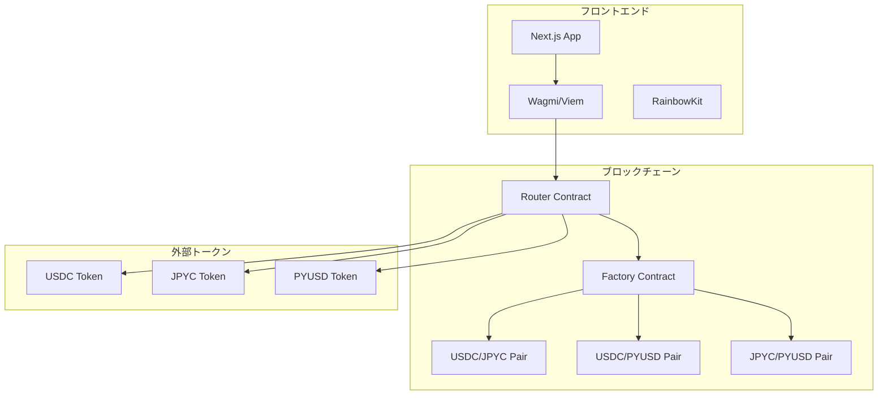

# AMM DEX 設計書

## 概要

Ethereum Sepolia テストネットワーク上で動作するAMM（自動マーケットメーカー）型DEXの技術設計書です。Uniswap V2のコア機能を参考に、流動性プール管理とトークンスワップ機能を提供します。

## アーキテクチャ

### システム全体構成



### レイヤー構成

1. **プレゼンテーション層**: Next.js + TailwindCSS
2. **Web3インタラクション層**: wagmi + viem + RainbowKit
3. **スマートコントラクト層**: Solidity + Hardhat
4. **ブロックチェーン層**: Ethereum Sepolia

## コンポーネントとインターフェース

### フロントエンドコンポーネント構成

````
src/
├── app/                     # Next.js App Router
│   ├── page.tsx            # ホーム/スワップページ
│   ├── pools/              # プール管理ページ
│   │   ├── page.tsx        # プール一覧
│   │   └── [id]/page.tsx   # プール詳細
│   └── layout.tsx          # 共通レイアウト
├── components/
│   ├── layout/
│   │   └── Header.tsx      # ヘッダー（ウォレット接続含む）
│   ├── swap/
│   │   ├── SwapCard.tsx    # スワップインターフェース
│   │   └── TokenSelector.tsx # トークン選択
│   ├── pools/
│   │   ├── PoolCard.tsx    # プール情報カード
│   │   ├── AddLiquidity.tsx # 流動性追加
│   │   └── RemoveLiquidity.tsx # 流動性削除
│   └── ui/                 # 基本UIコンポーネント
├── hooks/
│   ├── useSwap.ts          # スワップロジック
│   ├── usePools.ts         # プール管理
│   └── useTokens.ts        # トークン情報
├── lib/
│   ├── contracts.ts        # コントラクト設定
│   ├── constants.ts        # 定数定義
│   └── utils.ts            # ユーティリティ関数
└── types/
    ├── contracts.ts        # コントラクト型定義
    └── tokens.ts           # トークン型定義
```###
 スマートコントラクト構成

````

contracts/
├── core/
│ ├── AMMFactory.sol # ペア作成・管理
│ ├── AMMPair.sol # 流動性プール実装
│ └── AMMRouter.sol # スワップ・流動性管理
├── interfaces/
│ ├── IAMMFactory.sol # Factory インターフェース
│ ├── IAMMPair.sol # Pair インターフェース
│ └── IAMMRouter.sol # Router インターフェース
├── libraries/
│ ├── AMMLibrary.sol # 価格計算ライブラリ
│ └── SafeMath.sol # 安全な数学演算
└── utils/
└── WETH.sol # Wrapped Ether（テスト用）

````

### 主要インターフェース

#### IAMMRouter.sol
```solidity
interface IAMMRouter {
    function swapExactTokensForTokens(
        uint amountIn,
        uint amountOutMin,
        address[] calldata path,
        address to,
        uint deadline
    ) external returns (uint[] memory amounts);

    function addLiquidity(
        address tokenA,
        address tokenB,
        uint amountADesired,
        uint amountBDesired,
        uint amountAMin,
        uint amountBMin,
        address to,
        uint deadline
    ) external returns (uint amountA, uint amountB, uint liquidity);

    function removeLiquidity(
        address tokenA,
        address tokenB,
        uint liquidity,
        uint amountAMin,
        uint amountBMin,
        address to,
        uint deadline
    ) external returns (uint amountA, uint amountB);
}
````

#### IAMMPair.sol

```solidity
interface IAMMPair {
  function getReserves()
    external
    view
    returns (uint112 reserve0, uint112 reserve1, uint32 blockTimestampLast);
  function mint(address to) external returns (uint liquidity);
  function burn(address to) external returns (uint amount0, uint amount1);
  function swap(
    uint amount0Out,
    uint amount1Out,
    address to,
    bytes calldata data
  ) external;
  function token0() external view returns (address);
  function token1() external view returns (address);
}
```

## データモデル

### フロントエンド型定義

```typescript
// types/tokens.ts
export interface Token {
  address: `0x${string}`;
  symbol: string;
  name: string;
  decimals: number;
  logoURI?: string;
}

export interface TokenBalance {
  token: Token;
  balance: bigint;
  formatted: string;
}

// types/contracts.ts
export interface Pool {
  id: string;
  token0: Token;
  token1: Token;
  reserve0: bigint;
  reserve1: bigint;
  totalSupply: bigint;
  lpTokenBalance?: bigint;
}

export interface SwapQuote {
  amountIn: bigint;
  amountOut: bigint;
  priceImpact: number;
  minimumAmountOut: bigint;
  path: `0x${string}`[];
}

export interface LiquidityPosition {
  pool: Pool;
  lpTokenBalance: bigint;
  token0Amount: bigint;
  token1Amount: bigint;
  shareOfPool: number;
}
```

### コントラクト定数

```typescript
// lib/constants.ts
export const SUPPORTED_TOKENS: Record<string, Token> = {
  USDC: {
    address: '0x1c7D4B196Cb0C7B01d743Fbc6116a902379C7238',
    symbol: 'USDC',
    name: 'USD Coin',
    decimals: 6,
  },
  JPYC: {
    address: '0x431D5dfF03120AFA4bDf332c61A6e1766eF37BDB',
    symbol: 'JPYC',
    name: 'JPY Coin',
    decimals: 18,
  },
  PYUSD: {
    address: '0xCaC524BcA292aaade2DF8A05cC58F0a65B1B3bB9',
    symbol: 'PYUSD',
    name: 'PayPal USD',
    decimals: 6,
  },
} as const;

export const CONTRACT_ADDRESSES = {
  FACTORY: '0x...', // デプロイ後に設定
  ROUTER: '0x...', // デプロイ後に設定
} as const;

export const SLIPPAGE_OPTIONS = [0.1, 0.5, 1.0, 3.0] as const;
export const DEFAULT_SLIPPAGE = 0.5;
export const MAX_SLIPPAGE = 50;
```

## エラーハンドリング

### カスタムエラー定義

```solidity
// contracts/core/AMMRouter.sol
error InsufficientOutputAmount();
error InsufficientLiquidity();
error InvalidPath();
error Expired();
error InsufficientAAmount();
error InsufficientBAmount();
```

### フロントエンドエラーハンドリング

```typescript
// lib/errors.ts
export class SwapError extends Error {
  constructor(
    message: string,
    public code: 'INSUFFICIENT_BALANCE' | 'SLIPPAGE_EXCEEDED' | 'NETWORK_ERROR'
  ) {
    super(message);
    this.name = 'SwapError';
  }
}

export const handleContractError = (error: unknown): string => {
  if (error instanceof Error) {
    if (error.message.includes('InsufficientOutputAmount')) {
      return 'スリッページが大きすぎます。設定を調整してください。';
    }
    if (error.message.includes('InsufficientLiquidity')) {
      return '流動性が不足しています。';
    }
    if (error.message.includes('User rejected')) {
      return 'トランザクションがキャンセルされました。';
    }
  }
  return '予期しないエラーが発生しました。';
};
```

## テスト戦略

### スマートコントラクトテスト

```typescript
// test/AMMRouter.test.ts
describe('AMMRouter', () => {
  describe('swapExactTokensForTokens', () => {
    it('正常なスワップが実行される', async () => {
      // テストロジック
    });

    it('スリッページ制限でリバートする', async () => {
      // テストロジック
    });

    it('期限切れでリバートする', async () => {
      // テストロジック
    });
  });

  describe('addLiquidity', () => {
    it('初回流動性追加が成功する', async () => {
      // テストロジック
    });

    it('既存プールへの流動性追加が成功する', async () => {
      // テストロジック
    });
  });
});
```

### フロントエンドテスト

```typescript
// __tests__/components/SwapCard.test.tsx
describe('SwapCard', () => {
  it('トークン選択が正常に動作する', () => {
    // テストロジック
  });

  it('スワップ金額の計算が正確である', () => {
    // テストロジック
  });

  it('スリッページ設定が反映される', () => {
    // テストロジック
  });
});

// __tests__/hooks/useSwap.test.ts
describe('useSwap', () => {
  it('スワップクォートが正確に計算される', () => {
    // テストロジック
  });

  it('エラー状態が適切に処理される', () => {
    // テストロジック
  });
});
```

### E2Eテスト

````typescript
// e2e/swap.spec.ts
test('完全なスワップフロー', async ({ page }) => {
  // 1. ウォレット接続
  // 2. トークン選択
  // 3. 金額入力
  // 4. スワップ実行
  // 5. 結果確認
});

test('流動性追加フロー', async ({ page }) => {
  // 1. プールページ移動
  // 2. トークンペア選択
  // 3. 金額入力
  // 4. 流動性追加実行
  // 5. LPトークン確認
});
```## 技
術実装詳細

### Wagmi設定

```typescript
// lib/wagmi.ts
import { createConfig, http } from 'wagmi';
import { sepolia } from 'wagmi/chains';
import { injected, metaMask } from 'wagmi/connectors';

export const config = createConfig({
  chains: [sepolia],
  connectors: [
    injected(),
    metaMask(),
  ],
  transports: {
    [sepolia.id]: http('https://eth-sepolia.g.alchemy.com/v2/YOUR-PROJECT-ID'),
  },
});
````

### コントラクトABI定義

```typescript
// lib/abis.ts
export const ammRouterAbi = [
  {
    inputs: [
      { name: 'amountIn', type: 'uint256' },
      { name: 'amountOutMin', type: 'uint256' },
      { name: 'path', type: 'address[]' },
      { name: 'to', type: 'address' },
      { name: 'deadline', type: 'uint256' },
    ],
    name: 'swapExactTokensForTokens',
    outputs: [{ name: 'amounts', type: 'uint256[]' }],
    stateMutability: 'nonpayable',
    type: 'function',
  },
  {
    inputs: [
      { name: 'tokenA', type: 'address' },
      { name: 'tokenB', type: 'address' },
      { name: 'amountADesired', type: 'uint256' },
      { name: 'amountBDesired', type: 'uint256' },
      { name: 'amountAMin', type: 'uint256' },
      { name: 'amountBMin', type: 'uint256' },
      { name: 'to', type: 'address' },
      { name: 'deadline', type: 'uint256' },
    ],
    name: 'addLiquidity',
    outputs: [
      { name: 'amountA', type: 'uint256' },
      { name: 'amountB', type: 'uint256' },
      { name: 'liquidity', type: 'uint256' },
    ],
    stateMutability: 'nonpayable',
    type: 'function',
  },
] as const;

export const ammPairAbi = [
  {
    inputs: [],
    name: 'getReserves',
    outputs: [
      { name: 'reserve0', type: 'uint112' },
      { name: 'reserve1', type: 'uint112' },
      { name: 'blockTimestampLast', type: 'uint32' },
    ],
    stateMutability: 'view',
    type: 'function',
  },
  {
    inputs: [],
    name: 'token0',
    outputs: [{ name: '', type: 'address' }],
    stateMutability: 'view',
    type: 'function',
  },
  {
    inputs: [],
    name: 'token1',
    outputs: [{ name: '', type: 'address' }],
    stateMutability: 'view',
    type: 'function',
  },
] as const;

export const erc20Abi = [
  {
    inputs: [{ name: 'account', type: 'address' }],
    name: 'balanceOf',
    outputs: [{ name: '', type: 'uint256' }],
    stateMutability: 'view',
    type: 'function',
  },
  {
    inputs: [
      { name: 'spender', type: 'address' },
      { name: 'amount', type: 'uint256' },
    ],
    name: 'approve',
    outputs: [{ name: '', type: 'bool' }],
    stateMutability: 'nonpayable',
    type: 'function',
  },
] as const;
```

### カスタムフック実装

```typescript
// hooks/useSwap.ts
import { useWriteContract, useReadContract } from 'wagmi';
import { ammRouterAbi } from '@/lib/abis';
import { CONTRACT_ADDRESSES } from '@/lib/constants';

export const useSwap = () => {
  const { writeContract, isPending, error } = useWriteContract();

  const executeSwap = async (
    amountIn: bigint,
    amountOutMin: bigint,
    path: `0x${string}`[],
    to: `0x${string}`,
    deadline: bigint
  ) => {
    return writeContract({
      address: CONTRACT_ADDRESSES.ROUTER,
      abi: ammRouterAbi,
      functionName: 'swapExactTokensForTokens',
      args: [amountIn, amountOutMin, path, to, deadline],
    });
  };

  return {
    executeSwap,
    isPending,
    error,
  };
};

// hooks/usePools.ts
import { useReadContract } from 'wagmi';
import { ammPairAbi } from '@/lib/abis';

export const usePoolReserves = (pairAddress: `0x${string}`) => {
  const { data, isLoading, error } = useReadContract({
    address: pairAddress,
    abi: ammPairAbi,
    functionName: 'getReserves',
  });

  return {
    reserves: data
      ? {
          reserve0: data[0],
          reserve1: data[1],
          blockTimestampLast: data[2],
        }
      : null,
    isLoading,
    error,
  };
};
```

### 価格計算ロジック

```typescript
// lib/calculations.ts
export const calculateAmountOut = (
  amountIn: bigint,
  reserveIn: bigint,
  reserveOut: bigint
): bigint => {
  if (amountIn === 0n || reserveIn === 0n || reserveOut === 0n) {
    return 0n;
  }

  const amountInWithFee = amountIn * 997n;
  const numerator = amountInWithFee * reserveOut;
  const denominator = reserveIn * 1000n + amountInWithFee;

  return numerator / denominator;
};

export const calculatePriceImpact = (
  amountIn: bigint,
  amountOut: bigint,
  reserveIn: bigint,
  reserveOut: bigint
): number => {
  if (reserveIn === 0n || reserveOut === 0n) return 0;

  const currentPrice = Number(reserveOut) / Number(reserveIn);
  const executionPrice = Number(amountOut) / Number(amountIn);

  return Math.abs((executionPrice - currentPrice) / currentPrice) * 100;
};

export const calculateLiquidityMinted = (
  amountA: bigint,
  amountB: bigint,
  reserveA: bigint,
  reserveB: bigint,
  totalSupply: bigint
): bigint => {
  if (totalSupply === 0n) {
    // 初回流動性追加の場合
    return sqrt(amountA * amountB) - 1000n; // MINIMUM_LIQUIDITY
  }

  const liquidityA = (amountA * totalSupply) / reserveA;
  const liquidityB = (amountB * totalSupply) / reserveB;

  return liquidityA < liquidityB ? liquidityA : liquidityB;
};

// 平方根計算（Babylonian method）
const sqrt = (value: bigint): bigint => {
  if (value === 0n) return 0n;

  let x = value;
  let y = (value + 1n) / 2n;

  while (y < x) {
    x = y;
    y = (value / x + x) / 2n;
  }

  return x;
};
```

### RainbowKit統合

```typescript
// app/providers.tsx
'use client';

import { QueryClient, QueryClientProvider } from '@tanstack/react-query';
import { WagmiProvider } from 'wagmi';
import { RainbowKitProvider, getDefaultConfig } from '@rainbow-me/rainbowkit';
import { sepolia } from 'wagmi/chains';
import '@rainbow-me/rainbowkit/styles.css';

const config = getDefaultConfig({
  appName: 'AMM DEX',
  projectId: 'YOUR_PROJECT_ID',
  chains: [sepolia],
});

const queryClient = new QueryClient();

export function Providers({ children }: { children: React.ReactNode }) {
  return (
    <WagmiProvider config={config}>
      <QueryClientProvider client={queryClient}>
        <RainbowKitProvider>
          {children}
        </RainbowKitProvider>
      </QueryClientProvider>
    </WagmiProvider>
  );
}
```

### 状態管理

```typescript
// lib/store.ts
import { create } from 'zustand';
import { Token, Pool } from '@/types';

interface AppState {
  selectedTokens: {
    tokenA: Token | null;
    tokenB: Token | null;
  };
  slippage: number;
  pools: Pool[];
  setSelectedToken: (position: 'tokenA' | 'tokenB', token: Token) => void;
  setSlippage: (slippage: number) => void;
  setPools: (pools: Pool[]) => void;
  swapTokens: () => void;
}

export const useAppStore = create<AppState>((set) => ({
  selectedTokens: {
    tokenA: null,
    tokenB: null,
  },
  slippage: 0.5,
  pools: [],
  setSelectedToken: (position, token) =>
    set((state) => ({
      selectedTokens: {
        ...state.selectedTokens,
        [position]: token,
      },
    })),
  setSlippage: (slippage) => set({ slippage }),
  setPools: (pools) => set({ pools }),
  swapTokens: () =>
    set((state) => ({
      selectedTokens: {
        tokenA: state.selectedTokens.tokenB,
        tokenB: state.selectedTokens.tokenA,
      },
    })),
}));
```

## パフォーマンス最適化

### フロントエンド最適化

1. **React.memo**でコンポーネントの不要な再レンダリングを防止
2. **useMemo**で重い計算結果をキャッシュ
3. **useCallback**でイベントハンドラーを最適化
4. **React Query**でAPIレスポンスをキャッシュ
5. **Code Splitting**で初期バンドルサイズを削減

### スマートコントラクト最適化

1. **ガス効率的なアルゴリズム**の採用
2. **Storage読み書きの最小化**
3. **関数修飾子**でアクセス制御を効率化
4. **イベント**でオフチェーンデータ取得を最適化

### Web3インタラクション最適化

1. **Multicall**で複数のコントラクト呼び出しをバッチ処理
2. **適切なポーリング間隔**でリアルタイム更新を効率化
3. **トランザクション状態管理**でUX向上

## セキュリティ考慮事項

### スマートコントラクト

1. **ReentrancyGuard**で再入攻撃を防止
2. **SafeMath**でオーバーフロー/アンダーフローを防止
3. **アクセス制御**で権限管理を適切に実装
4. **入力値検証**で不正なパラメータを拒否

### フロントエンド

1. **入力値サニタイゼーション**
2. **CSP（Content Security Policy）**の設定
3. **HTTPS**の強制
4. **ウォレット接続の検証**

この設計書に基づいて、次のフェーズでタスクリストを作成し、段階的な実装を進めていきます。
