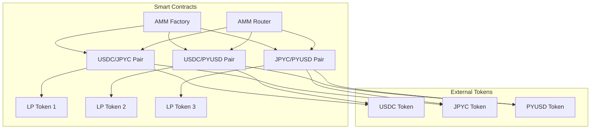
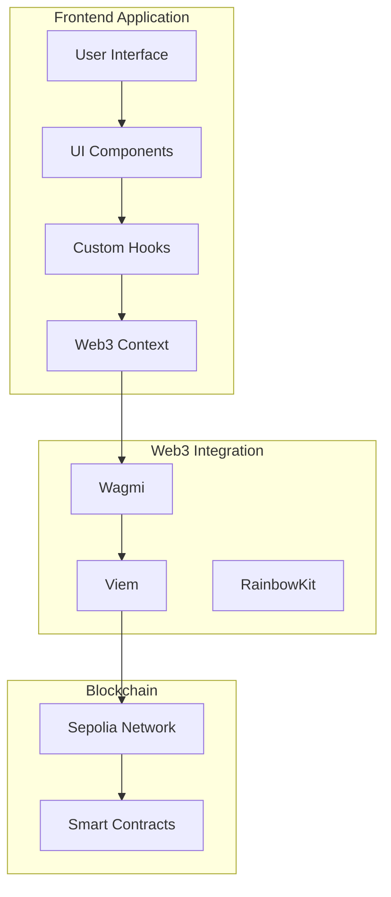

# Design Document

## Overview

このAMM DEXは、Ethereum Sepoliaテストネット上で動作する学習用の分散型取引所です。Uniswap V2のコア機能を参考に、シンプルで理解しやすい実装を目指します。

### 主要コンポーネント
- **AMM Factory Contract**: 新しい取引ペアの作成と管理
- **AMM Pair Contract**: 個別の取引ペアの流動性とスワップ機能
- **Router Contract**: ユーザーフレンドリーなインターフェース
- **Frontend Application**: React/Next.jsベースのWebアプリケーション

### 対象トークン
- USDC: 0x1c7D4B196Cb0C7B01d743Fbc6116a902379C7238
- JPYC: 0x431D5dfF03120AFA4bDf332c61A6e1766eF37BDB
- PYUSD: 0xCaC524BcA292aaade2DF8A05cC58F0a65B1B3bB9

## Project Structure

### Root Directory Structure
```
├── .kiro/                    # Kiro設定とステアリングルール
├── .github/                  # GitHub設定とワークフロー
├── docs/                     # ドキュメントと仕様書
├── pkgs/                    # モノレポパッケージ
│   ├── contract/            # スマートコントラクト開発
│   └── frontend/            # フロントエンドアプリケーション
├── .gitignore               # Git除外設定
├── package.json             # ルートパッケージ設定
├── pnpm-lock.yaml           # pnpm依存関係ロック
├── pnpm-workspace.yaml      # pnpmワークスペース設定
├── biome.json               # Biomeフォーマッター・リンター設定
├── README.md                # プロジェクト概要とセットアップガイド
└── LICENSE                  # プロジェクトライセンス
```

### Smart Contract Package Structure (`pkgs/contract/`)
```bash
├── README.md                 # コントラクトパッケージの説明
├── contracts/               # Solidityファイル群
│   ├── AMMFactory.sol       # ファクトリーコントラクト
│   ├── AMMPair.sol          # ペアコントラクト
│   ├── AMMRouter.sol        # ルーターコントラクト
│   └── interfaces/          # インターフェース定義
│       ├── IAMMFactory.sol
│       ├── IAMMPair.sol
│       └── IAMMRouter.sol
├── hardhat.config.ts        # Hardhat設定ファイル
├── helpers/                 # ユーティリティ関数
│   └── contractsJsonHelper.ts # デプロイ管理ヘルパー
├── ignition/                # デプロイメントスクリプト
│   ├── AMMFactory.ts        # ファクトリーデプロイ
│   └── AMMRouter.ts         # ルーターデプロイ
├── outputs/                 # デプロイメント出力
│   └── contracts-sepolia.json # Sepoliaデプロイ情報
├── tasks/                   # Hardhatタスク
│   ├── AMMFactory/          # ファクトリータスク
│   │   ├── createPair.ts    # ペア作成タスク
│   │   └── getPairs.ts      # ペア一覧取得タスク
│   ├── AMMPair/             # ペアタスク
│   │   ├── addLiquidity.ts  # 流動性追加タスク
│   │   ├── removeLiquidity.ts # 流動性除去タスク
│   │   └── swap.ts          # スワップタスク
│   └── AMMRouter/           # ルータータスク
│       ├── addLiquidity.ts  # ルーター経由流動性追加
│       ├── removeLiquidity.ts # ルーター経由流動性除去
│       └── swapTokens.ts    # ルーター経由スワップ
├── test/                    # テストファイル
│   ├── AMMFactory.test.ts   # ファクトリーテスト
│   ├── AMMPair.test.ts      # ペアテスト
│   └── AMMRouter.test.ts    # ルーターテスト
├── .solhint.json            # Solhint設定
├── .solhintignore           # Solhint除外設定
├── package.json             # パッケージ設定
└── tsconfig.json            # TypeScript設定
```

### Frontend Package Structure (`pkgs/frontend/`)
```bash
├── app/                     # Next.js App Routerディレクトリ
│   ├── globals.css          # グローバルスタイル
│   ├── layout.tsx           # ルートレイアウト
│   ├── page.tsx             # ホームページ（スワップ画面）
│   ├── liquidity/           # 流動性管理ページ
│   │   ├── page.tsx         # 流動性提供画面
│   │   └── manage/          # 流動性管理画面
│   │       └── page.tsx
│   ├── pools/               # プール一覧ページ
│   │   └── page.tsx
│   └── api/                 # API実装（必要に応じて）
├── components/              # UIコンポーネント
│   ├── ui/                  # Shadcn/UIコンポーネント
│   ├── swap/                # スワップ関連コンポーネント
│   │   ├── SwapInterface.tsx
│   │   ├── TokenSelector.tsx
│   │   └── SwapButton.tsx
│   ├── liquidity/           # 流動性関連コンポーネント
│   │   ├── LiquidityProvider.tsx
│   │   ├── PoolManager.tsx
│   │   └── LiquidityPosition.tsx
│   ├── pools/               # プール関連コンポーネント
│   │   ├── PoolList.tsx
│   │   └── PoolCard.tsx
│   └── wallet/              # ウォレット関連コンポーネント
│       ├── WalletConnector.tsx
│       └── NetworkSwitcher.tsx
├── hooks/                   # カスタムフック
│   ├── useSwap.ts           # スワップ機能フック
│   ├── useLiquidity.ts      # 流動性管理フック
│   ├── useTokenBalance.ts   # トークン残高フック
│   ├── usePairData.ts       # ペア情報フック
│   └── useContractRead.ts   # コントラクト読み取りフック
├── lib/                     # ライブラリ関数
│   ├── utils.ts             # 汎用ユーティリティ
│   ├── contracts.ts         # コントラクト設定
│   ├── tokens.ts            # トークン設定
│   └── calculations.ts      # 価格計算ロジック
├── utils/                   # ユーティリティ関数
│   ├── formatters.ts        # フォーマット関数
│   ├── validators.ts        # バリデーション関数
│   └── constants.ts         # 定数定義
├── styles/                  # スタイル関連
├── public/                  # 静的ファイル
│   ├── tokens/              # トークンアイコン
│   └── icons/               # アプリアイコン
├── components.json          # Shadcn/UI設定
├── package.json             # パッケージ設定
├── tsconfig.json            # TypeScript設定
├── tailwind.config.js       # Tailwind CSS設定
├── postcss.config.js        # PostCSS設定
├── next.config.js           # Next.js設定
├── .env.local               # 環境変数（ローカル）
├── .env.example             # 環境変数サンプル
└── .gitignore               # Git除外設定
```

### File Naming Conventions
- **Directories**: kebab-case (`amm-factory`, `token-selector`)
- **Smart Contracts**: PascalCase (`AMMFactory.sol`, `AMMPair.sol`)
- **React Components**: PascalCase (`SwapInterface.tsx`, `TokenSelector.tsx`)
- **Utilities/Hooks**: camelCase (`useSwap.ts`, `formatters.ts`)
- **Test Files**: `.test.ts` extension (`AMMFactory.test.ts`)
- **Constants**: UPPER_SNAKE_CASE (`MAX_SLIPPAGE`, `DEFAULT_DEADLINE`)

## Architecture

### Smart Contract Architecture



### Frontend Architecture



## Components and Interfaces

### 1. AMM Factory Contract

**Purpose**: 新しい取引ペアの作成と管理

**Key Functions**:
```solidity
contract AMMFactory {
    mapping(address => mapping(address => address)) public getPair;
    address[] public allPairs;
    
    function createPair(address tokenA, address tokenB) external returns (address pair);
    function allPairsLength() external view returns (uint);
}
```

**Features**:
- ペア作成時の重複チェック
- ペア一覧の管理
- イベント発行による透明性確保

### 2. AMM Pair Contract

**Purpose**: 個別取引ペアの流動性管理とスワップ実行

**Key Functions**:
```solidity
contract AMMPair is ERC20 {
    address public token0;
    address public token1;
    uint112 private reserve0;
    uint112 private reserve1;
    
    function mint(address to) external returns (uint liquidity);
    function burn(address to) external returns (uint amount0, uint amount1);
    function swap(uint amount0Out, uint amount1Out, address to, bytes calldata data) external;
    function getReserves() external view returns (uint112 _reserve0, uint112 _reserve1, uint32 _blockTimestampLast);
}
```

**AMM Formula**: 
- Constant Product Formula: `x * y = k`
- Price Impact Calculation: `Δy = (y * Δx) / (x + Δx)`
- Fee Structure: 0.3% trading fee

### 3. AMM Router Contract

**Purpose**: ユーザーフレンドリーなインターフェース提供

**Key Functions**:
```solidity
contract AMMRouter {
    function addLiquidity(
        address tokenA,
        address tokenB,
        uint amountADesired,
        uint amountBDesired,
        uint amountAMin,
        uint amountBMin,
        address to,
        uint deadline
    ) external returns (uint amountA, uint amountB, uint liquidity);
    
    function removeLiquidity(
        address tokenA,
        address tokenB,
        uint liquidity,
        uint amountAMin,
        uint amountBMin,
        address to,
        uint deadline
    ) external returns (uint amountA, uint amountB);
    
    function swapExactTokensForTokens(
        uint amountIn,
        uint amountOutMin,
        address[] calldata path,
        address to,
        uint deadline
    ) external returns (uint[] memory amounts);
}
```

### 4. Contract Helper Functions

**Purpose**: デプロイメントとコントラクト管理のためのユーティリティ関数

**Key Helper Functions**:
```typescript
// helpers/contractsJsonHelper.ts
function writeContractAddress(params: {
  group: string;
  name: string | null;
  value: string;
  network: string;
}): void;

function loadDeployedContractAddresses(network: string): Record<string, any>;

function resetContractAddressesJson(params: { network: string }): void;
```

**Features**:
- デプロイ済みコントラクトアドレスの管理
- ネットワーク別のコントラクト情報保存
- デプロイメント履歴の追跡
- JSON形式での設定管理

**Usage Pattern**:
```typescript
// デプロイスクリプト内での使用例
writeContractAddress({
  group: "contracts",
  name: "AMMFactory",
  value: factoryAddress,
  network: network.name,
});
```

### 5. Frontend Components

#### Core Components:
- **SwapInterface**: メインのスワップ画面
- **LiquidityProvider**: 流動性提供画面
- **PoolManager**: プール管理画面
- **WalletConnector**: ウォレット接続コンポーネント

#### Custom Hooks:
- **useSwap**: スワップ機能のロジック
- **useLiquidity**: 流動性管理のロジック
- **useTokenBalance**: トークン残高の取得
- **usePairData**: ペア情報の取得

## Data Models

### 1. Token Model
```typescript
interface Token {
  address: string;
  symbol: string;
  name: string;
  decimals: number;
  logoURI?: string;
}
```

### 2. Pair Model
```typescript
interface Pair {
  address: string;
  token0: Token;
  token1: Token;
  reserve0: bigint;
  reserve1: bigint;
  totalSupply: bigint;
  lpToken: string;
}
```

### 3. Swap Model
```typescript
interface SwapParams {
  tokenIn: Token;
  tokenOut: Token;
  amountIn: bigint;
  amountOutMin: bigint;
  slippageTolerance: number;
  deadline: number;
}
```

### 4. Liquidity Model
```typescript
interface LiquidityParams {
  tokenA: Token;
  tokenB: Token;
  amountADesired: bigint;
  amountBDesired: bigint;
  amountAMin: bigint;
  amountBMin: bigint;
  deadline: number;
}
```

## Error Handling

### Smart Contract Errors
```solidity
error InsufficientLiquidity();
error InvalidToken();
error ExpiredDeadline();
error InsufficientAmount();
error InsufficientOutputAmount();
error ExcessiveInputAmount();
```

### Frontend Error Handling
- **Network Errors**: 接続エラー、RPC エラー
- **Transaction Errors**: ガス不足、スリッページ超過
- **User Errors**: 残高不足、承認不足
- **Validation Errors**: 入力値検証エラー

### Error Recovery Strategies
1. **Automatic Retry**: 一時的なネットワークエラー
2. **User Notification**: 明確なエラーメッセージ表示
3. **Fallback Options**: 代替手段の提案
4. **State Recovery**: アプリケーション状態の復旧

## Deployment and Management Strategy

### Contract Deployment Process
1. **Helper Function Setup**: contractsJsonHelper.tsの設定
2. **Network Configuration**: Hardhat設定でSepoliaネットワーク設定
3. **Sequential Deployment**: Factory → Router → Pair作成の順序
4. **Address Management**: デプロイ済みアドレスの自動保存
5. **Verification**: Etherscanでのコントラクト検証

### Task Management
- **Hardhat Tasks**: 各コントラクトの主要機能をタスク化
  - **Factory Tasks**: ペア作成、ペア一覧取得
  - **Pair Tasks**: 流動性追加・除去、スワップ実行
  - **Router Tasks**: ユーザーフレンドリーなインターフェース
- **Network-Specific Tasks**: Sepoliaネットワーク用のタスク設定
- **Post-Deployment Setup**: デプロイ後のペア作成をタスクで実行

### Configuration Management
```typescript
// outputs/contracts-sepolia.json の例
{
  "contracts": {
    "AMMFactory": "0x...",
    "AMMRouter": "0x...",
    "USDC_JPYC_Pair": "0x...",
    "USDC_PYUSD_Pair": "0x...",
    "JPYC_PYUSD_Pair": "0x..."
  }
}
```

## Testing Strategy

### Smart Contract Testing
```typescript
describe("AMM Factory", () => {
  it("should create new pair correctly");
  it("should prevent duplicate pair creation");
  it("should emit PairCreated event");
});

describe("AMM Pair", () => {
  it("should mint liquidity tokens correctly");
  it("should burn liquidity tokens correctly");
  it("should execute swaps with correct pricing");
  it("should handle edge cases (zero amounts, etc.)");
});

describe("AMM Router", () => {
  it("should add liquidity through router");
  it("should remove liquidity through router");
  it("should execute swaps through router");
  it("should handle slippage protection");
});

describe("Contract Helper Functions", () => {
  it("should save contract addresses correctly");
  it("should load deployed contract addresses");
  it("should handle network-specific configurations");
  it("should manage deployment history");
});
```

### Frontend Testing
```typescript
describe("Swap Component", () => {
  it("should calculate swap amounts correctly");
  it("should handle slippage settings");
  it("should validate user inputs");
  it("should connect to wallet properly");
});

describe("Liquidity Component", () => {
  it("should calculate liquidity ratios");
  it("should handle token approvals");
  it("should display pool information");
});
```

### Integration Testing
- **End-to-End Flows**: 完全なユーザージャーニーテスト
- **Cross-Contract Interactions**: コントラクト間の連携テスト
- **Gas Optimization**: ガス使用量の最適化テスト
- **Security Testing**: セキュリティ脆弱性テスト

## Security Considerations

### Smart Contract Security
1. **Reentrancy Protection**: OpenZeppelin ReentrancyGuard使用
2. **Integer Overflow/Underflow**: Solidity 0.8+の自動チェック
3. **Access Control**: 適切な権限管理
4. **Input Validation**: 全ての入力値の検証

### Frontend Security
1. **Input Sanitization**: XSS攻撃の防止
2. **Secure Communication**: HTTPS通信の強制
3. **Private Key Protection**: ウォレット統合のセキュリティ
4. **Transaction Verification**: トランザクション内容の確認

### Operational Security
1. **Contract Verification**: Etherscanでのコントラクト検証
2. **Audit Preparation**: コードレビューとテスト
3. **Emergency Procedures**: 緊急時の対応手順
4. **Monitoring**: システム監視とアラート

## Performance Optimization

### Smart Contract Optimization
- **Gas Efficiency**: 最適化されたSolidityコード
- **Storage Layout**: 効率的なストレージ使用
- **Function Optimization**: 頻繁に呼ばれる関数の最適化

### Frontend Optimization
- **Code Splitting**: 必要な部分のみの読み込み
- **Caching Strategy**: 効率的なデータキャッシュ
- **Bundle Optimization**: Webpackの最適化設定
- **Image Optimization**: 画像の最適化と遅延読み込み

### Network Optimization
- **RPC Optimization**: 効率的なRPC呼び出し
- **Batch Requests**: 複数リクエストのバッチ処理
- **Connection Pooling**: 接続の再利用
- **Error Handling**: 適切なエラーハンドリング