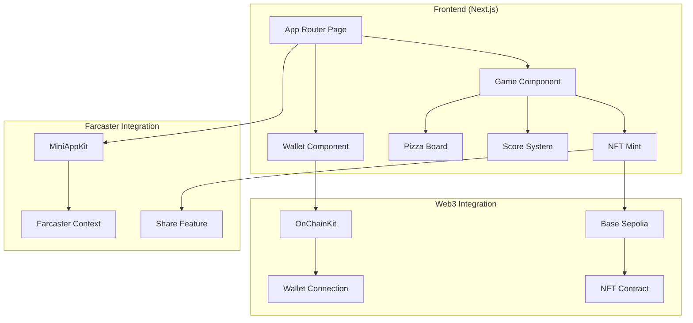

# Design Document

## Overview

ピザルーレットゲームは、PizzaDAO × Ethreactor Mini Hackathon @ ETHTokyo '25向けのFarcaster MiniAppです。ユーザーは回転するピザボードをタップしてピザを完成させ、スコアに応じてNFTをミントできるWeb3ミニゲームです。1画面完結型のシンプルなゲーム体験を提供し、短期間のハッカソンに適した実装可能な設計を採用します。

## Architecture

### システム構成



### 技術スタック

- **フロントエンド**: Next.js 15.3.3 (App Router), TypeScript
- **スタイリング**: Tailwind CSS
- **Web3**: OnChainKit (latest), viem 2.27.2, wagmi 2.16.0
- **Farcaster**: @farcaster/frame-sdk 0.1.8
- **ブロックチェーン**: Base Sepolia
- **状態管理**: React useState/useEffect, @tanstack/react-query
- **その他**: @upstash/redis 1.34.4

## Components and Interfaces

### 1. メインページコンポーネント (`app/page.tsx`)

```typescript
interface GameState {
  pizzaSlices: PizzaSlice[]
  currentScore: number
  gameStatus: 'idle' | 'playing' | 'completed'
  isSpinning: boolean
  rank: 'diamond' | 'gold' | 'silver' | 'bronze' | null
}

interface PizzaSlice {
  id: number
  flavor: PizzaFlavor | null
  position: number // 0-11 (12切れ)
}

type PizzaFlavor = 'margherita' | 'pepperoni' | 'mushroom' | 'hawaiian' | 'veggie' | 'meat'
```

### 2. ピザボードコンポーネント

```typescript
interface PizzaBoardProps {
  slices: PizzaSlice[]
  isSpinning: boolean
  onSliceClick: (sliceId: number) => void
}

interface PizzaBoardState {
  rotation: number
  animationDuration: number
}
```

### 3. ウォレットアドレスの取得

```typescript
// wagmiのReactHookを利用する
import { useAccount } from 'wagmi';

const { address } = useAccount();
```

### 4. スコアシステム

```typescript
interface ScoreCalculator {
  calculateScore(slices: PizzaSlice[]): number
  determineRank(score: number): GameRank
  getAdjacentBonus(slices: PizzaSlice[]): number
  getPerfectBonus(slices: PizzaSlice[]): number
  detectSpecialPatterns(slices: PizzaSlice[]): SpecialPattern[]
}

type GameRank = 'diamond' | 'gold' | 'silver' | 'bronze'

interface SpecialPattern {
  name: string
  title: string
  description: string
  bonus: number
  animation: string
  emoji: string
}

const RANK_THRESHOLDS = {
  diamond: 800,
  gold: 600,
  silver: 400,
  bronze: 0
} as const

const SPECIAL_PATTERNS = {
  ROYAL_STRAIGHT_PIZZA_FLUSH: {
    name: 'royal_straight_pizza_flush',
    title: 'ロイヤルストレートピザフラッシュ！',
    description: '全て同じ味で完璧なピザを完成！まさに伝説のピザ職人！',
    bonus: 500,
    animation: 'rainbow-explosion',
    emoji: '👑🍕✨'
  },
  PIZZA_MASTER: {
    name: 'pizza_master',
    title: 'ピザマスター',
    description: '6切れ以上の連続同味！あなたはピザの達人です！',
    bonus: 200,
    animation: 'golden-sparkle',
    emoji: '🎖️🍕'
  },
  BALANCE_CRAFTSMAN: {
    name: 'balance_craftsman',
    title: 'バランス職人',
    description: '4種類の味を均等配置！完璧なバランス感覚！',
    bonus: 150,
    animation: 'harmony-wave',
    emoji: '⚖️🍕'
  },
  COMBO_KING: {
    name: 'combo_king',
    title: 'コンボキング',
    description: '隣接ボーナス5回達成！連続技の王者！',
    bonus: 100,
    animation: 'combo-flash',
    emoji: '🔥🍕'
  },
  RAINBOW_PIZZA: {
    name: 'rainbow_pizza',
    title: 'レインボーピザ',
    description: '全6種類の味を使用！多様性の美しさ！',
    bonus: 120,
    animation: 'rainbow-spin',
    emoji: '🌈🍕'
  },
  LUCKY_SEVEN: {
    name: 'lucky_seven',
    title: 'ラッキーセブン',
    description: '7切れが同じ味！幸運のピザ！',
    bonus: 77,
    animation: 'lucky-stars',
    emoji: '🍀🍕'
  }
} as const
```

### 5. NFTミントコンポーネント

```typescript
interface NFTMintProps {
  rank: GameRank
  score: number
  flavorCombination: string
  onMintSuccess: (tokenId: number) => void
  onMintError: (error: Error) => void
}

interface NFTMetadata {
  name: string
  description: string
  image: string
  attributes: Array<{
    trait_type: string
    value: string | number
  }>
}

// safeMint関数の呼び出し用インターフェース
interface MintParams {
  to: string // ウォレットアドレス
  uri: string // メタデータURI
}
```

### 6. トランザクションカードコンポーネント

OnChainKit及びMiniAppKitの恩恵を最大限享受するためにトランザクション実行のコンポーネントは以下を共通のコンポーネントとして必ず利用する実装としてください。

```ts
import { useNotification } from '@coinbase/onchainkit/minikit';
import {
  Transaction,
  TransactionButton,
  TransactionError,
  TransactionResponse,
  TransactionStatus,
  TransactionStatusAction,
  TransactionStatusLabel,
  TransactionToast,
  TransactionToastAction,
  TransactionToastIcon,
  TransactionToastLabel,
} from '@coinbase/onchainkit/transaction';
import { useCallback } from 'react';
import { Abi } from 'viem';
import { useAccount } from 'wagmi';

type TransactionProps = {
  calls: {
    address: `0x${string}`,
    abi: Abi,
    functionName: string,
    args: (string | number | bigint | boolean | `0x${string}`)[],
  }[];
};

/**
 * トランザクションカードコンポーネント
 * @returns
 */
export function TransactionCard({ calls }: TransactionProps) {
  const { address } = useAccount();

  const sendNotification = useNotification();

  /**
   * トランザクションが正常に実行された時に実行するコールバック関数
   */
  const handleSuccess = useCallback(
    async (response: TransactionResponse) => {
      const transactionHash = response.transactionReceipts[0].transactionHash;

      console.log(`Transaction successful: ${transactionHash}`);

      // トランザクション成功時に MiniKit 通知を送る
      await sendNotification({
        title: 'Congratulations!',
        body: `You sent your a transaction, ${transactionHash}!`,
      });
    },
    [sendNotification]
  );

  return (
    <div className="w-full">
      {address ? (
        <Transaction
          calls={calls}
          onSuccess={handleSuccess}
          onError={(error: TransactionError) => console.error('Transaction failed:', error)}
        >
          <TransactionButton className="text-md text-white" text="Mint NFT" />
          <TransactionStatus>
            <TransactionStatusAction />
            <TransactionStatusLabel />
          </TransactionStatus>
          <TransactionToast className="mb-4">
            <TransactionToastIcon />
            <TransactionToastLabel />
            <TransactionToastAction />
          </TransactionToast>
        </Transaction>
      ) : (
        <p className="mt-2 text-center text-sm text-yellow-400">
          Connect your wallet to send a transaction
        </p>
      )}
    </div>
  );
}
```

メソッド名の指定や引数は呼び出し元のコンポーネントにて実装する

以下はERC1155のNFTをミントする時の実装例。

```ts
// NFTを発行するためのコールデータ
  const calls = useMemo(
    () =>
      address && score > 0
        ? [
            {
              address: NFT_ADDRESS as `0x${string}`,
              abi: SHOOTING_GAME_NFT_ABI,
              functionName: 'mint',
              args: [address as `0x${string}`, 0, score, '0x'] as [
                string,
                number,
                number,
                string,
              ],
            },
          ]
        : [],
    [address, score]
  );

  console.log('calls', calls);

  return (
    <Card title="Mini Shooting Game">
      <div ref={containerRef} className="flex w-full flex-col items-center">
        <canvas
          ref={canvasRef}
          className="rounded-lg border border-[var(--app-card-border)] bg-[var(--app-background)]"
        />
        {!running && !gameOver && (
          <button
            onClick={startGame}
            className="mt-4 rounded-md bg-[var(--app-accent)] px-4 py-2 text-sm font-medium text-white hover:bg-[var(--app-accent-hover)] active:bg-[var(--app-accent-active)]"
          >
            Tap / Space to Start
          </button>
        )}
        {gameOver && score > 0 && <TransactionCard calls={calls} />}
        {gameOver && score === 0 && (
          <p className="mt-3 text-sm text-yellow-400">
            Score is 0 — nothing to mint. Try again!
          </p>
        )}
      </div>
    </Card>
  );
```

### 7. Providerコンポーネント

OnChainKit及びMiniAppKitの恩恵を最大限享受するために`providers.tsx`は必ず以下の実装にしてください。

```ts
'use client';

// アプリ全体のプロバイダー（MiniKitProvider）
// - OnchainKit の設定（API Key / Chain / 外観）
// - フレームの文脈や Wagmi のコネクタを内部で設定
import { MiniKitProvider } from '@coinbase/onchainkit/minikit';
import { type ReactNode } from 'react';
import { baseSepolia } from 'wagmi/chains';

/**
 * Providers コンポーネント
 * @param props
 * @returns
 */
export function Providers(props: { children: ReactNode }) {
  return (
    <MiniKitProvider
      apiKey={process.env.NEXT_PUBLIC_ONCHAINKIT_API_KEY}
      chain={baseSepolia}
      config={{
        appearance: {
          mode: 'auto',
          theme: 'mini-app-theme',
          name: process.env.NEXT_PUBLIC_ONCHAINKIT_PROJECT_NAME,
          logo: process.env.NEXT_PUBLIC_ICON_URL,
        },
      }}
    >
      {props.children}
    </MiniKitProvider>
  );
}
```

## Data Models

### ゲーム状態管理

```typescript
// ゲーム状態のContext
interface GameContextType {
  gameState: GameState
  startGame: () => void
  spinBoard: () => void
  selectSlice: (sliceId: number) => void
  resetGame: () => void
  mintNFT: () => Promise<void>
}

// ローカルストレージ用のデータ構造
interface GameHistory {
  gamesPlayed: number
  highScore: number
  nftsMinted: number
  lastPlayedAt: string
}
```

### NFTコントラクト構造

```solidity
// SPDX-License-Identifier: MIT
// Compatible with OpenZeppelin Contracts ^5.4.0
pragma solidity ^0.8.27;

import {ERC721} from "@openzeppelin/contracts/token/ERC721/ERC721.sol";
import {ERC721URIStorage} from "@openzeppelin/contracts/token/ERC721/extensions/ERC721URIStorage.sol";
import {Ownable} from "@openzeppelin/contracts/access/Ownable.sol";

contract PizzaDaoMiniHackathon is ERC721, ERC721URIStorage, Ownable {
    uint256 private _nextTokenId;

    constructor(address initialOwner)
        ERC721("PizzaDaoMiniHackathon", "PDMH")
        Ownable(initialOwner)
    {}

    function _baseURI() internal pure override returns (string memory) {
        return "https://chocolate-nice-gazelle-823.mypinata.cloud/ipfs/bafybeicqgesjwbsbs6kfe5mduz56o7ooeh7ynonjozel3lc5t2jer7v52a/";
    }

    function safeMint(address to, string memory uri)
        public
        returns (uint256)
    {
        uint256 tokenId = _nextTokenId++;
        _safeMint(to, tokenId);
        _setTokenURI(tokenId, uri);
        return tokenId;
    }

    // The following functions are overrides required by Solidity.
    function tokenURI(uint256 tokenId)
        public
        view
        override(ERC721, ERC721URIStorage)
        returns (string memory)
    {
        return super.tokenURI(tokenId);
    }

    function supportsInterface(bytes4 interfaceId)
        public
        view
        override(ERC721, ERC721URIStorage)
        returns (bool)
    {
        return super.supportsInterface(interfaceId);
    }
}
```

### NFT Mint ABI

```json
{
  "inputs": [
    {
      "internalType": "address",
      "name": "to",
      "type": "address"
    },
    {
      "internalType": "string",
      "name": "uri",
      "type": "string"
    }
  ],
  "name": "safeMint",
  "outputs": [
    {
      "internalType": "uint256",
      "name": "",
      "type": "uint256"
    }
  ],
  "stateMutability": "nonpayable",
  "type": "function"
}
```

## Error Handling

### エラータイプ定義

```typescript
enum GameErrorType {
  WALLET_CONNECTION_FAILED = 'WALLET_CONNECTION_FAILED',
  NETWORK_MISMATCH = 'NETWORK_MISMATCH',
  NFT_MINT_FAILED = 'NFT_MINT_FAILED',
  INSUFFICIENT_FUNDS = 'INSUFFICIENT_FUNDS',
  GAME_STATE_ERROR = 'GAME_STATE_ERROR'
}

interface GameError {
  type: GameErrorType
  message: string
  details?: any
}
```

### エラーハンドリング戦略

1. **ウォレット接続エラー**: ユーザーフレンドリーなメッセージで再試行を促す
2. **ネットワークエラー**: Base Sepoliaへの切り替えを案内
3. **NFTミントエラー**: ガス不足やトランザクション失敗の詳細を表示
4. **ゲーム状態エラー**: 自動リセット機能を提供

### エラー表示コンポーネント

```typescript
interface ErrorDisplayProps {
  error: GameError | null
  onRetry?: () => void
  onDismiss: () => void
}
```

## Testing Strategy

### 単体テスト

1. **スコア計算ロジック**
   - 隣接ボーナスの正確性
   - パーフェクトボーナスの計算
   - ランク判定の境界値テスト

2. **ゲーム状態管理**
   - 状態遷移の正確性
   - リセット機能の動作確認

3. **ピザボード操作**
   - クリック位置の正確な検出
   - 回転アニメーションの制御

### 統合テスト

1. **ウォレット接続フロー**
   - OnChainKitとの統合テスト
   - Base Sepoliaネットワーク接続

2. **NFTミント機能**
   - コントラクトとの相互作用
   - メタデータの正確性

3. **Farcaster統合**
   - MiniAppKitの動作確認
   - 共有機能のテスト

### E2Eテスト

1. **完全なゲームフロー**
   - ゲーム開始からNFTミントまで
   - エラーケースの処理

2. **レスポンシブデザイン**
   - モバイルデバイスでの操作性
   - 異なる画面サイズでの表示

### テスト環境

- **単体テスト**: Jest + React Testing Library
- **E2Eテスト**: Playwright
- **Web3テスト**: Hardhat + Base Sepolia Testnet

## UI/UX Design

### レイアウト構成

```
┌─────────────────────────────────┐
│ Header: Wallet Connection       │
├─────────────────────────────────┤
│                                 │
│     Pizza Board (Circular)      │
│        12 slices arranged       │
│         like dart board         │
│                                 │
├─────────────────────────────────┤
│ Score: XXX | Rank: GOLD        │
├─────────────────────────────────┤
│ [Start Game] [Mint NFT]        │
└─────────────────────────────────┘
```

### カラーパレット

```typescript
const PIZZA_COLORS = {
  margherita: '#FF6B6B',    // 赤（トマト）
  pepperoni: '#FF8E53',     // オレンジ
  mushroom: '#4ECDC4',      // ティール
  hawaiian: '#FFE66D',      // 黄色（パイナップル）
  veggie: '#95E1D3',        // 緑
  meat: '#A8E6CF'           // ライトグリーン
} as const

const RANK_COLORS = {
  diamond: '#B9F2FF',       // ダイアモンドブルー
  gold: '#FFD700',          // ゴールド
  silver: '#C0C0C0',        // シルバー
  bronze: '#CD7F32'         // ブロンズ
} as const
```

### アニメーション

1. **ボード回転**: CSS transform + transition
2. **スライス選択**: ホバー効果 + クリックフィードバック
3. **スコア更新**: カウントアップアニメーション
4. **ランク表示**: フェードイン + スケールエフェクト
5. **特別演出アニメーション**:
   - `rainbow-explosion`: 虹色の爆発エフェクト（ロイヤルストレートピザフラッシュ用）
   - `golden-sparkle`: 金色のキラキラエフェクト（ピザマスター用）
   - `harmony-wave`: 調和の波エフェクト（バランス職人用）
   - `combo-flash`: 連続フラッシュエフェクト（コンボキング用）
   - `rainbow-spin`: レインボー回転エフェクト（レインボーピザ用）
   - `lucky-stars`: 幸運の星エフェクト（ラッキーセブン用）
6. **パーティクルエフェクト**: 役職達成時の祝福エフェクト
7. **バウンス効果**: 役職タイトル表示時のバウンスアニメーション
8. **フェードイン演出**: 役職説明文の段階的表示

## Project Structure

### フォルダ構成

MiniAppKitテンプレートをベースとした構成：

.well-known
/farcaster.json

```
pizza-roulette-game/
├── app/                          # Next.js App Router
│   ├── .well-known
│   │   └── farcaster.json
|   │        └── route.ts         # farcaster用のメタデータファイル
│   ├── api/                      # API Routes
│   │   ├── notify                # Farcaster通知に関するAPI
│   │   ├── webhook               # Farcaster WebHookに関するAPI
│   │   └── metadata/             # NFTメタデータ生成API
│   ├── layout.tsx                # ルートレイアウト
│   ├── providers.tsx             # 全コンポーネント共通のプロバイダーコンポーネント
│   └── page.tsx                  # メインゲームページ
├── css
│   ├── globals.css               # グローバルスタイル              
│   └── theme.css                 # テーマスタイル
├── components/                   # Reactコンポーネント
│   ├── game/                     # ゲーム関連コンポーネント
│   │   ├── PizzaBoard.tsx        # ピザボードコンポーネント
│   │   ├── ScoreDisplay.tsx      # スコア表示
│   │   ├── GameControls.tsx      # ゲーム操作ボタン
│   │   ├── SpecialPatternDisplay.tsx # 特別役職演出表示
│   │   └── AnimationEffects.tsx  # アニメーションエフェクト
│   ├── wallet/                   # ウォレット関連
│   │   └── WalletConnect.tsx     # ウォレット接続
│   └── ui/                       # 共通UIコンポーネント
├── lib/    
│   ├── notification-client.ts
│   ├── notification.ts
│   ├── redis.ts                
│   └── game/                     # ゲームロジック
│       ├── scoreCalculator.ts    # スコア計算
│       ├── patternDetector.ts    # 特別パターン検出
│       ├── gameState.ts          # ゲーム状態管理
│       └── animations/           # アニメーション関連
│           └── effects.ts        # エフェクト定義
├── utils
│    ├── abis                     # ABIを格納するフォルダ
│    └── constants.ts             # NFTコントラクトアドレス等の定数を格納するファイル
├── types/                        # TypeScript型定義
│   ├── game.ts                   # ゲーム関連型
│   └── nft.ts                    # NFT関連型
├── public/                       # 静的ファイル
│   ├── images/                   # 画像ファイル
│   └── icons/                    # アイコンファイル
├── package.json                  # 依存関係定義
├── tailwind.config.js            # Tailwind設定
├── next.config.js                # Next.js設定
├── .prettierrc                   # フォーマッター設定
├── .eslintrc.json                # リンター設定
├── tsconfig.json                 # TypeScript設定
└── .env.local                    # 環境変数
```

### Package.json

```json
{
  "name": "unchain-base-mini-app",
  "version": "0.1.0",
  "private": true,
  "scripts": {
    "dev": "next dev",
    "build": "next build",
    "start": "next start",
    "lint": "next lint",
    "format": "npx prettier --write ."
  },
  "dependencies": {
    "@coinbase/onchainkit": "latest",
    "@farcaster/frame-sdk": "^0.1.8",
    "@tanstack/react-query": "^5",
    "@upstash/redis": "^1.34.4",
    "next": "^15.3.3",
    "react": "^18",
    "react-dom": "^18",
    "viem": "^2.27.2",
    "wagmi": "^2.16.0"
  },
  "devDependencies": {
    "@types/node": "^22.18.0",
    "@types/react": "^18",
    "@types/react-dom": "^18",
    "eslint": "^8",
    "eslint-config-next": "15.3.3",
    "eslint-config-prettier": "^10.1.1",
    "eslint-plugin-prettier": "^5.2.3",
    "eslint-plugin-react": "^7.37.4",
    "eslint-plugin-react-hooks": "^5.2.0",
    "postcss": "^8",
    "prettier": "^3.5.3",
    "prettier-plugin-tailwindcss": "^0.6.14",
    "tailwindcss": "^3.4.1",
    "typescript": "^5"
  }
}
```

## NFTのメタデータ情報

### 共通 URI

https://chocolate-nice-gazelle-823.mypinata.cloud/ipfs/bafybeicqgesjwbsbs6kfe5mduz56o7ooeh7ynonjozel3lc5t2jer7v52a

### 各NFTまでのメタデータ情報

- `bronze`

  共通URI/bronze

- `silver`

  共通URI/silver

- `gold`

  共通URI/gold

- `diamond`

  共通URI/diamond

## Performance Considerations

### 最適化戦略

1. **画像最適化**: Next.js Image コンポーネント使用
2. **コード分割**: 動的インポートでバンドルサイズ削減
3. **状態管理**: 不要な再レンダリングを防ぐuseMemo/useCallback
4. **Web3最適化**: トランザクション待機時間の最小化

### ハッカソン制約への対応

1. **開発時間短縮**: 既存コード及びライブラリの最大活用
2. **デプロイ簡素化**: Vercel + Base Sepolia
3. **機能絞り込み**: コア機能に集中
4. **エラー処理**: 基本的なケースのみ対応