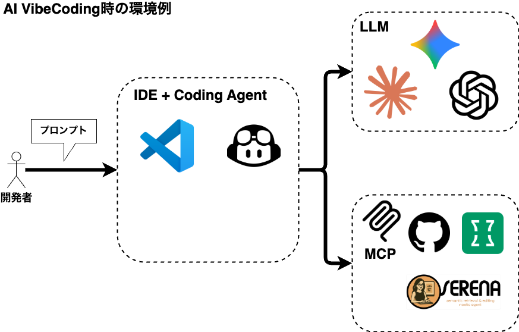

# Web3 AI Vibe Coding Starter Kit 

AI VibeCodingでWeb3アプリを開発するためのスターターキットです！

## イベントページ

[Luma - Build the Future with AI! A Hands-on Web3 AI Vibe Coding Workshop](https://luma.com/um87sb5p)

## AI VibeCodingの環境例



## AI VibeCodingでWeb3アプリを開発する時の手順

1. 作りたいものを決める。

2. 作りたいものの要件定義書と設計書を作成する(Kiroの使用を推奨). 
   ※ 生成したものを別にAIコーディングツールにレビューさせるのもあり

3. 要件定義書を元にタスクリストを作成する(Kiroの使用を推奨). 
   ※ 生成したものを別にAIコーディングツールにレビューさせるのもあり

4. 実装を開始する. 
   この時、コントラクトとフロントエンドの開発を一気に進めるよりも段階的に進めた方が良い。　　
   - プロジェクト全体のセットアップ
    - スマートコントラクトの実装(テストやタスクファイルの実装を含む)
    - スマートコントラクトの機能検証
    - フロントエンドの実装
    - デザインを整える
    - E2Eテスト
    - 完成
   
## AI VibeCodingを上手に進めるためにした方が良いこと

1. 複数のモデルを使い分ける
    - 要件定義やタスクリストの洗い出し、レビュー
      - Gemini

    - コーディング
      - Claude

2. MCPを使ってAIの機能を強化する
    - プロジェクト全体の把握
      - Serena MCP
    - 最新のコード、ドキュメントの参照
      - context7
    - 複雑な問題も細かいステップに分解して思考プロセス全体の進行状況を明示的に追跡
      - sequential-thinking

3. 段階的に進める
    - 要件定義の作成
    - タスクリストの作成
    - プロジェクト全体のセットアップ
    - スマートコントラクトの実装
    - フロントエンドの実装

4. カスタムインストラクションファイルのセットアップ
    - 大事！！
    - 各コーディングエージェント毎に設定が微妙に異なるので注意！
  
## 参考情報

```bash
.claude Claude Codeを使う時の設定例
.gemini Gemini CLIを使う時の設定例
.github GitHub Copilotを使う時の設定例
```